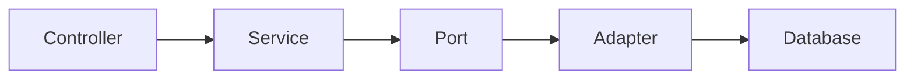

# MarketMind Academy Content Standard

This academy is written as a working engineering curriculum, not as detached notes. Every lesson should teach the concept, show where it appears in MarketMind AI, and prepare the reader to explain the same trade-off in an interview or production review.

## Standard lesson structure

Use this structure for every major topic as the academy grows:

| Section | Purpose |
|---|---|
| Overview | Explain the topic in plain language. |
| Problem statement | State the real engineering problem the topic solves. |
| Why it exists | Explain the historical or industry need. |
| Real industry use cases | Show how production teams use it. |
| How MarketMind uses it | Ground the concept in this repository. |
| Architecture | Show components, boundaries, and dependencies. |
| Internal working | Explain runtime mechanics. |
| Request flow | Walk through an API, job, or UI flow. |
| Lifecycle | Explain creation, state changes, cleanup, and failure. |
| Best practices | Give rules that hold up in production. |
| Common mistakes | Name the traps engineers actually hit. |
| Performance | Discuss latency, throughput, memory, I/O, and cost. |
| Security | Discuss validation, data exposure, secrets, and boundaries. |
| Production considerations | Discuss deployment, rollback, config, and operations. |
| Scalability | Explain how the design grows. |
| Monitoring | Explain logs, metrics, health, and alerts. |
| Interview questions | Include junior through senior prompts. |
| Principal Engineer questions | Focus on strategy, trade-offs, and organizational impact. |
| Follow-up questions | Teach how interviewers deepen the topic. |
| Scenario questions | Use real incidents and design constraints. |
| Hands-on exercises | Make the learner change or operate the system. |
| Code walkthrough | Point to real classes in MarketMind. |
| Assignments | Define measurable outputs. |
| Summary | Close with the durable mental model. |

## Writing quality bar

Good academy pages should feel like a blend of:

- official Spring documentation for accuracy;
- AWS architecture guidance for trade-offs;
- Netflix/Uber engineering writing for operational realism;
- Google-style design docs for crisp reasoning;
- interview coaching notes for explanation depth.

Avoid vague claims like “this improves scalability.” Say what scales, where the bottleneck moves, and what new failure modes appear.

## Grounding rule

Only document features that exist in the repository today. If a feature is planned but not implemented, label it clearly as a future extension and do not teach it as current behavior.

Current implemented learning surface includes Java 21, Spring Boot 3, Maven, PostgreSQL, Flyway, Docker Compose, Redis, Qdrant, Ollama, React, TypeScript, Vite, REST/OpenAPI, validation, hexagonal architecture, source registry, source validation, source intelligence, discovery, generic HTML PDF crawling, document download, PDF storage/versioning, text extraction, chunking, embeddings, RAG, portfolio import, market price refresh, scheduler, pipeline orchestration, correlation IDs, logging, Grafana, Loki, Promtail, and local observability.

## Code reference style

When referencing code, prefer exact class names and paths:

- `DocumentDownloadService` — download orchestration.
- `PdfTextExtractionService` — text extraction use case.
- `DocumentEmbeddingService` — chunking and embedding workflow.
- `QdrantVectorStore` — vector database adapter.
- `RagQuestionAnswerService` — retrieval plus answer generation.
- `PipelineOrchestrator` — autonomous stage orchestration.
- `SourceIntelligenceService` — enterprise source metadata and connector operations.
- `CorrelationIdFilter` — request traceability.

## Mermaid diagram standard

Use Mermaid for flows, boundaries, and dependency graphs. Keep diagrams small enough to explain in an interview.

## Interview progression

Each topic should support four explanation levels:

| Level | Expected answer |
|---|---|
| Junior | What it is and when to use it. |
| Mid | How it works and common failure modes. |
| Senior | Trade-offs, testing, and production concerns. |
| Principal | System boundaries, long-term evolution, risk, and organizational alignment. |

