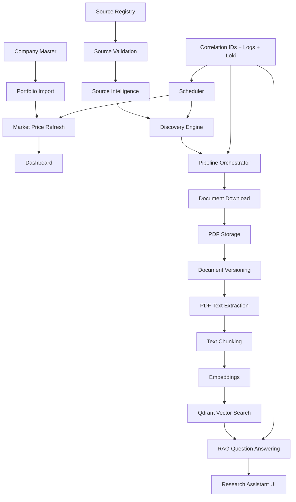
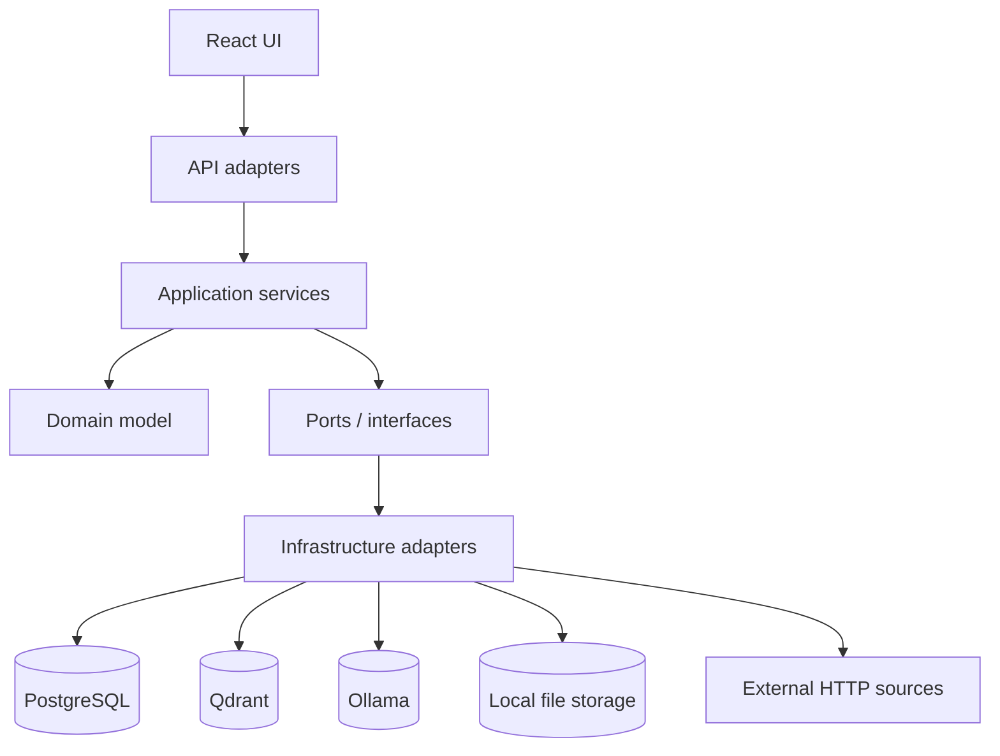
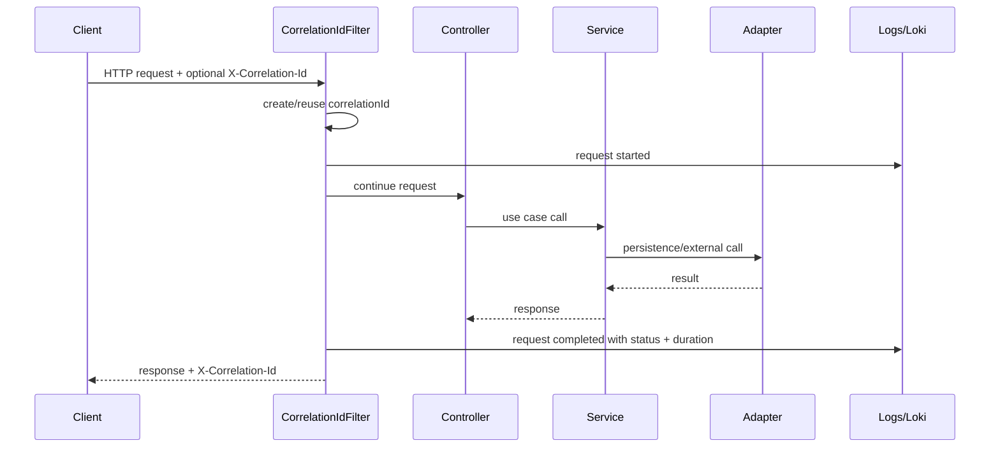
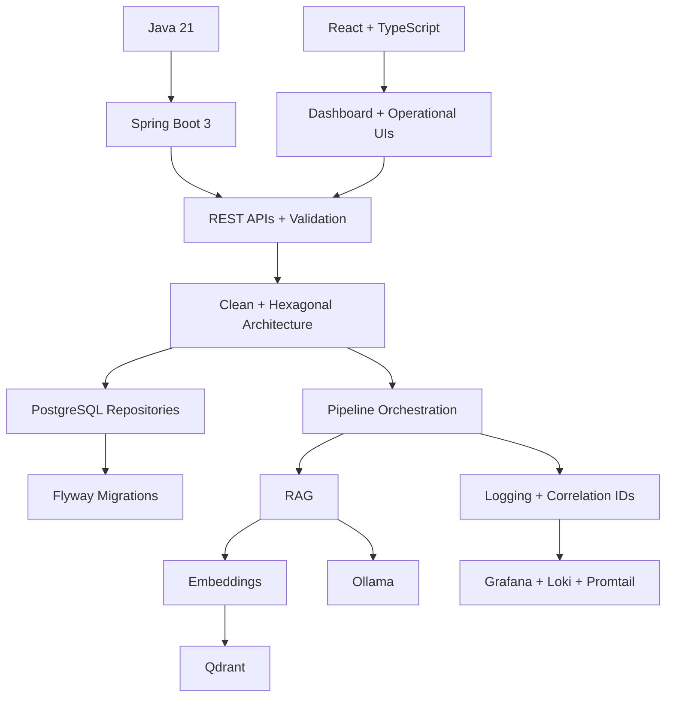

# MarketMind AI Knowledge Graphs

These maps show how the implemented parts of MarketMind AI connect. Use them for daily revision, interview storytelling, and architecture reviews.

## Product capability graph

## Document intelligence graph

```mermaid
flowchart LR
    Source[Trusted source] --> Discovery[Discover official PDF URL]
    Discovery --> Dedup[Normalize and deduplicate URL]
    Dedup --> Download[Download document]
    Download --> Store[Store PDF locally]
    Store --> Version[Create document version]
    Version --> Extract[Extract PDF text]
    Extract --> Chunk[Split text into chunks]
    Chunk --> Embed[Generate embeddings]
    Embed --> Index[Index in Qdrant]
    Index --> Retrieve[Retrieve relevant chunks]
    Retrieve --> LLM[Ollama chat model]
    LLM --> Answer[Answer with citations]
```

## Hexagonal dependency graph

The dependency direction is intentional: the business workflow should not depend directly on PostgreSQL, Qdrant, Ollama, HTTP clients, or UI components.

## Runtime traceability graph

## Learning dependency graph

Recommended path: Java → Spring → REST → Clean Architecture → PostgreSQL/Flyway → document pipeline → RAG/vector search → observability → frontend operating views → system design.

