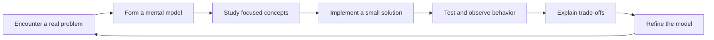
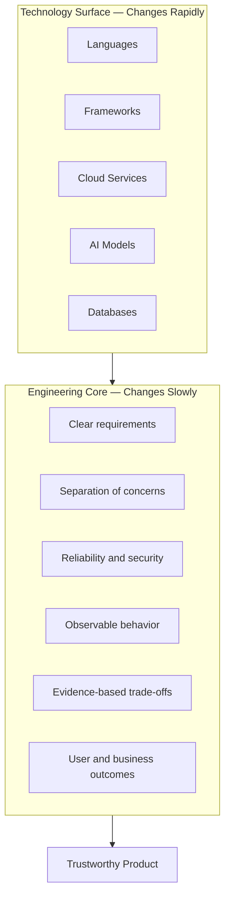
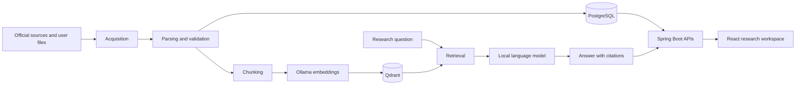
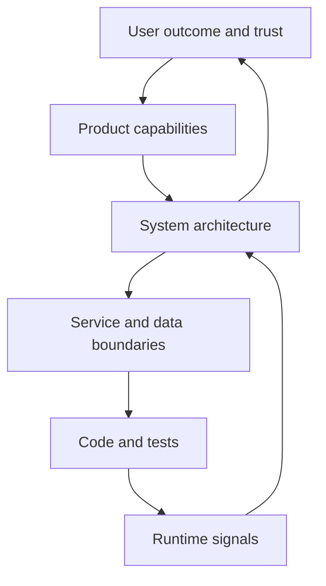

# Section 1 — Why This Academy Exists

Software engineering is one of the few professions in which the tools can change significantly while a person is still learning to use them. A framework considered modern today may become legacy infrastructure within a few years. A programming language can gain new concurrency models, a database can add vector search, and an application architecture can shift from servers to containers to managed platforms. Artificial intelligence now accelerates this cycle further: engineers can generate code, analyze incidents, search documentation, and prototype systems faster than ever before.

Yet the central work of engineering has not changed.

An engineer still has to understand a problem, identify constraints, make defensible trade-offs, verify behavior, protect users, and operate the system over time. Technology changes the materials. Engineering determines whether they become a dependable bridge or an expensive pile of components.

This academy exists to teach that distinction.

Its purpose is not merely to teach Java, Spring Boot, React, PostgreSQL, Docker, or retrieval-augmented generation. You will study those technologies seriously. The deeper goal is to develop the judgment to design and evolve a real system: to understand not only *how* something works, but *why it belongs*, *how it can fail*, and *what evidence would prove it correct*.

That kind of judgment is the foundation of a world-class engineer.

---

## 1.1 Software Engineering Is a Continuous-Learning Profession

Learning is not a temporary stage that ends when an engineer receives a degree, completes a course, or gets a first job. It is part of the operating model of the profession.

Modern products span languages, frameworks, databases, networks, infrastructure, observability, security, user experience, and increasingly machine learning. No engineer knows all of these areas completely. More importantly, nobody can learn them once and assume that the knowledge will remain sufficient. PostgreSQL evolves. Java evolves. Browser behavior evolves. Security threats evolve. AI models and their operational patterns evolve at extraordinary speed.

Continuous learning is therefore not an extracurricular activity. It is risk management.

An engineer who stops learning gradually loses the ability to recognize new failure modes. The danger is rarely that the person forgets syntax. Syntax can be searched in seconds. The deeper danger is that an outdated mental model causes the engineer to make a confident but incorrect decision: trusting a deprecated security mechanism, selecting an unsuitable storage model, misunderstanding a distributed transaction, or treating an AI-generated answer as verified evidence.

The strongest engineers build a repeatable learning loop:



This loop differs from passive consumption. Watching a lesson may introduce a concept, but implementation exposes the edges of that concept. Testing reveals whether your assumptions were accurate. Explaining the trade-offs forces you to turn an intuition into a model that another engineer can inspect.

Continuous learning also compounds. Understanding HTTP clarifies REST APIs. Understanding transactions clarifies repositories. Understanding dependency direction makes framework behavior less mysterious. Understanding retrieval turns an AI answer into a measurable pipeline. The result is not simply more facts, but a more connected engineering mind.

### Engineering Insight: Learn Below the Abstraction

Frameworks are useful because they hide complexity, but engineers become fragile when they know only the framework.

If you use Spring Boot, learn enough HTTP, dependency injection, threads, transactions, and JDBC to understand what Spring is coordinating. If you use React Query, understand caching, asynchronous state, retries, and invalidation. If you use Qdrant, understand vectors, similarity measures, payload filtering, and indexing. If you use Ollama, understand model context, inference latency, prompt construction, and failure handling.

You do not need to reimplement every abstraction. You do need to know what promise it makes and where that promise ends.

---

## 1.2 Technologies Change; Engineering Principles Endure

The history of software contains a long sequence of changing technologies: mainframes, client-server systems, web applications, service-oriented architecture, cloud computing, mobile platforms, microservices, containers, serverless systems, and generative AI. Each wave introduces new capabilities and new vocabulary. It can create the impression that success belongs to whoever learns the newest tool first.

Tool fluency matters, but it is not the same as engineering maturity.

The enduring principles are quieter:

| Changing implementation | Enduring engineering question |
|---|---|
| Monolith, microservices, or serverless functions | Where should responsibilities and failure boundaries exist? |
| PostgreSQL, document store, or vector database | What access patterns, consistency guarantees, and scale must the data model support? |
| REST, events, or streaming | What contract connects producers and consumers? |
| Virtual machines, containers, or managed platforms | How will the system be deployed, observed, recovered, and secured? |
| Rules engine, machine learning model, or LLM | How will correctness, uncertainty, provenance, and harmful failure be managed? |
| One framework replaced by another | Which business rules must remain independent of infrastructure? |

These questions survive technology cycles because they arise from constraints rather than fashion.

Netflix’s infrastructure has evolved, but its enduring concerns remain availability, graceful degradation, observability, recovery, and designing for failure. Amazon’s emphasis on accountable ownership and defined interfaces shows how weak contracts create both organizational and technical coupling. Google demonstrates the leverage of automation, review, and testing at scale. Microsoft’s evolution across desktop, cloud, developer platforms, and AI shows why new technology must coexist with reliability, compatibility, security, and customer trust.

Bloomberg operates where information freshness and accuracy are essential; attractive presentation cannot compensate for stale or ambiguous financial data. Zerodha likewise shows why financial technology must combine accessible experience with operational discipline. OpenAI makes another principle visible: capable models still require evaluation, safety controls, monitoring, and honest communication of uncertainty.

The companies are different. The recurring principles are not.



The diagram is deliberately inverted from how beginners often think. Technologies do not define the engineering core. They are selected and arranged in service of it.

### Engineering Insight: Prefer Transferable Models

A narrow question is: “How do I create a Spring annotation for this behavior?”

A transferable question is: “What lifecycle, dependency, or boundary is this annotation expressing?”

A narrow question is: “Which Qdrant endpoint performs a search?”

A transferable question is: “How is relevance represented, filtered, measured, and communicated to the user?”

The second form of each question produces knowledge that survives the next framework, database, or model.

---

## 1.3 Why One Real Product Beats One Hundred Tutorials

Tutorials are valuable. They can provide an efficient introduction to a tool, show a canonical path, and reduce the anxiety of an unfamiliar subject. The problem begins when tutorials become the entire learning strategy.

A tutorial is usually designed to succeed. Its requirements are stable, its data is clean, and its architecture is selected in advance. Difficult decisions are removed so the learner can focus on the lesson. This makes tutorials good demonstrations and weak simulations of professional engineering.

A real product behaves differently.

Requirements conflict. A schema becomes restrictive. A public API times out. A PDF contains no text layer. A spreadsheet places its headers on row twenty-three. CORS rejects a frontend request. A migration version is already taken. The system must continue to make sense after these changes.

This is where engineering is learned.

| Tutorial learning | Product learning |
|---|---|
| Follow a known sequence | Discover the sequence from constraints |
| Reproduce a solution | Defend a design decision |
| Optimize for completion | Optimize for maintainability and outcomes |
| Work with ideal inputs | Handle malformed, missing, stale, and hostile inputs |
| See one component | Trace behavior across the full system |
| Discard the project afterward | Evolve the system without breaking existing behavior |
| Treat errors as interruptions | Treat errors as information about the design |

Building a single long-lived product creates continuity. A decision made in the database layer affects the API. The API affects frontend state. Operational constraints affect configuration. Security policy affects every boundary. AI quality depends on document acquisition, parsing, chunking, embedding, retrieval, prompting, and citation rendering.

You begin to experience architecture not as a diagram, but as the accumulated consequence of decisions.

This is why one serious product can teach more than one hundred disconnected tutorials. The product creates **productive resistance**. It refuses to let concepts remain isolated.

For example, a JPA tutorial can show how to save an entity. MarketMind AI asks whether that entity is a domain or persistence model, which constraints belong in the database, how migrations preserve existing environments, which values are authoritative, and how an operator diagnoses an incorrect result.

Likewise, a basic AI tutorial can embed three paragraphs and return an answer. MarketMind AI must preserve document versions, trace citations to evidence, tolerate partial embedding failures, scope retrieval, communicate confidence, and refuse to answer when evidence is insufficient.

Those questions are the curriculum.

---

## 1.4 MarketMind AI as a Long-Term Learning Platform

MarketMind AI is an AI-powered investment research and portfolio assistant. Its product vision is to collect official company information, process annual reports and quarterly results, monitor portfolio and market data, and provide evidence-based decision support. It is explicitly not an automatic trading system. Its value depends on provenance, transparency, and disciplined handling of uncertainty.

That vision makes it an unusually rich engineering platform.

The product combines several kinds of systems:

- a React and TypeScript user interface;
- a Java 21 and Spring Boot backend;
- PostgreSQL for transactional and analytical metadata;
- Flyway for controlled schema evolution;
- Qdrant for vector retrieval;
- Ollama for local embeddings and language-model inference;
- document download, versioning, and PDF extraction pipelines;
- portfolio import and market-price workflows;
- Docker and deployment infrastructure;
- compliance, security, observability, and testing concerns.

Each capability can be studied independently, but the greatest learning comes from their interaction.



This is not merely a feature pipeline. It is a map of engineering disciplines.

Acquisition teaches resilient networking and source governance. Parsing teaches defensive programming and imperfect-data handling. PostgreSQL teaches modeling, constraints, indexing, and migrations. Retrieval teaches embeddings, similarity, filtering, and evaluation. The API teaches contracts and error semantics. The frontend teaches asynchronous state and trust-centered presentation. Deployment teaches configuration and operational readiness.

The same product can grow with the engineer.

A beginner can implement a validated endpoint. An intermediate engineer can define transactional boundaries and adapters. A senior engineer can reason about reliability, observability, and migration safety. A principal engineer can ask whether the architecture supports the organization’s future, whether its claims are evidence-based, and where complexity should deliberately *not* be introduced.

MarketMind AI therefore serves two purposes at once:

1. It is a product with a coherent user mission.
2. It is a laboratory for developing engineering judgment.

The product remains real enough that shortcuts have consequences, but bounded enough for deliberate study.

---

## 1.5 The Philosophy of Learning by Building

Learning by building does not mean writing code first and thinking later. Nor does it mean creating features as quickly as possible. Serious project-based learning follows a disciplined cycle.

### 1. Understand the user outcome

Begin with the capability, not the framework.

“Add Qdrant” is not a user outcome. “Allow a researcher to retrieve evidence relevant to a question and inspect its source” is. The second statement gives technology a purpose and introduces quality criteria.

### 2. Identify constraints

Constraints shape architecture. MarketMind AI uses local Ollama rather than a paid model API. It must not store secrets in source code. It provides decision support rather than automatic trading. AI answers must be grounded in indexed documents and carry citations. These rules are not documentation decorations; they influence interfaces, data models, configuration, UI language, and testing.

### 3. Build the smallest coherent vertical slice

A vertical slice crosses the necessary layers to deliver observable behavior. For document Q&A, that may include one extraction record, chunking, one embedding client, vector storage, retrieval, an answer endpoint, and citation rendering.

The purpose is to validate architecture with working evidence before expanding it.

### 4. Test assumptions at boundaries

Most production failures occur at boundaries: network calls, file formats, database constraints, clocks, concurrency, configuration, and user input. Test these deliberately.

The happy path proves that a feature can work. Boundary tests show whether failure remains understandable.

### 5. Observe and explain

If a feature fails, can you tell where and why? If it succeeds, can you trace the result to its source? Can you explain the trade-offs to another engineer?

An implementation that cannot be explained is not yet mastered.

### 6. Refactor after evidence

Premature abstraction guesses at the future. Refactoring uses evidence from the present. Improve the design when duplication, coupling, or unstable boundaries become visible.

### 7. Record the decision

Architecture Decision Records, API guidelines, migration notes, and security documentation preserve context that code alone cannot express. This matters because systems outlive the memory of the people who first designed them.

### Engineering Insight: Completion Is Not the Same as Capability

A feature is not complete because an endpoint returns `200 OK`.

For a production-minded engineer, completion includes:

- valid and invalid inputs have defined behavior;
- state changes are transactional where necessary;
- dependencies have timeouts and bounded failure modes;
- logs and health indicators support diagnosis;
- sensitive data and secrets are protected;
- tests cover important decisions;
- documentation explains operation and constraints;
- the user can distinguish evidence, uncertainty, and failure.

This academy will repeatedly ask you to widen your definition of “done.”

---

## 1.6 What World-Class Engineering Actually Looks Like

“World-class” does not mean knowing every technology, producing the most code, or designing the most elaborate architecture. It means creating unusually high leverage through sound judgment.

A world-class engineer:

- reduces ambiguity before multiplying implementation effort;
- distinguishes essential complexity from accidental complexity;
- makes systems easier for other engineers to understand;
- treats security, reliability, and operability as design inputs;
- uses evidence instead of authority to evaluate technical choices;
- understands both local code and system-wide consequences;
- communicates trade-offs clearly to technical and non-technical partners;
- knows when a simple solution is sufficient;
- recognizes uncertainty and creates a path to learn safely;
- improves the engineering environment, not only the assigned feature.

Netflix’s resilience work is valuable not because every company should copy its architecture, but because it demonstrates deliberate learning from failure. Amazon’s interface discipline is valuable not because every team needs hundreds of services, but because explicit contracts and ownership reduce coordination cost. Google’s testing and automation practices matter because repeated human effort and unverified changes do not scale. Microsoft’s platform evolution shows that compatibility and migration strategy can be as important as invention.

Bloomberg and Zerodha remind us that financial systems must communicate data quality and timing clearly. OpenAI reminds us that model capability is only one component of a responsible AI product. In every case, the lesson is not “copy the technology.” The lesson is “understand the forces that produced the decision.”

That is how principal engineers think.

They move between levels:



They can inspect a method without losing sight of the product, and discuss a strategy without losing respect for implementation reality.

Every later topic in this academy depends on this mindset.

The tools will give you capability. The principles will help you use it well. The product will turn both into experience.

---

## Key Takeaways

1. Continuous learning is part of professional software engineering, not a phase before “real work.”
2. Technologies change rapidly, while principles such as clear boundaries, reliability, security, observability, and evidence-based trade-offs remain durable.
3. Tutorials introduce tools; long-lived products develop judgment by exposing ambiguity, integration problems, failures, and evolutionary pressure.
4. MarketMind AI is both a meaningful product and a learning laboratory spanning frontend, backend, data, infrastructure, financial systems, and local AI.
5. Learning by building should be disciplined: understand outcomes, identify constraints, implement coherent slices, test boundaries, observe behavior, refactor from evidence, and record decisions.
6. World-class engineering is measured by leverage and trust—not by code volume, architectural fashion, or memorized syntax.
7. AI-assisted development increases the importance of verification, provenance, security, and strong mental models.

## Reflection Questions

1. Which technologies do you currently know only at the framework or tutorial level?
2. When did a real implementation last force you to revise a technical assumption?
3. Can you name three engineering principles that would remain relevant if the MarketMind AI technology stack changed completely?
4. How do you currently decide whether a feature is genuinely complete?
5. Which part of MarketMind AI is least familiar to you, and what underlying fundamentals should you learn before its framework details?
6. What evidence would make you trust an AI-generated investment research answer?
7. Where might a technically correct implementation still create a poor or unsafe user outcome?

## Interview Questions

1. Why is project-based learning often more effective than completing isolated tutorials?
2. Describe the difference between a technology choice and an engineering principle.
3. How would you evaluate whether a team should adopt a new framework?
4. What does it mean to learn “below the abstraction”?
5. Explain how you would build a vertical slice for document-grounded question answering.
6. What qualities distinguish a senior engineer from a principal engineer?
7. Why are observability and security design concerns rather than final deployment tasks?
8. How would you communicate uncertainty in an AI-assisted financial research product?

## Principal Engineer Thinking

For every major MarketMind AI capability, practice asking:

- **Outcome:** What user or business outcome justifies this capability?
- **Trust:** What could cause a user to reach an incorrect conclusion?
- **Boundary:** Where should ownership, data, and failure be isolated?
- **Evidence:** What measurements or tests would validate the design?
- **Evolution:** Which assumptions are likely to change?
- **Operations:** How will the team detect, diagnose, and recover from failure?
- **Security:** What data, identity, or infrastructure could be exposed?
- **Simplicity:** What is the least complex design that satisfies the known constraints?
- **Reversibility:** Which decisions are easy to change, and which deserve deeper analysis now?
- **Communication:** Can another engineer understand why this design exists?

Principal engineering is not constant abstraction. It is the ability to apply the right level of thinking at the right time.

## Assignment

Create a one-page engineering learning charter for your work on MarketMind AI.

Include:

1. three technical areas you want to strengthen;
2. one enduring engineering principle connected to each area;
3. one MarketMind AI capability through which you will practice it;
4. the evidence that will demonstrate learning, such as tests, diagrams, benchmarks, incident simulations, or design explanations;
5. one failure mode you will intentionally study;
6. one decision you expect to revisit after gaining implementation evidence.

Then choose an existing MarketMind AI feature and trace it through the system:

```text
User outcome
→ API contract
→ application service
→ domain model
→ persistence or external adapter
→ tests
→ runtime configuration
→ user-visible failure behavior
```

Write down every assumption you discover. Mark each assumption as verified, unverified, or invalid. The objective is not to modify the feature yet; it is to practice seeing the complete engineering system.

## Reading List

- *The Pragmatic Programmer* — David Thomas and Andrew Hunt
- *Designing Data-Intensive Applications* — Martin Kleppmann
- *A Philosophy of Software Design* — John Ousterhout
- *Accelerate* — Nicole Forsgren, Jez Humble, and Gene Kim
- *Site Reliability Engineering* — Betsy Beyer, Chris Jones, Jennifer Petoff, and Niall Richard Murphy
- *Team Topologies* — Matthew Skelton and Manuel Pais
- *Working Effectively with Legacy Code* — Michael Feathers
- *Building Evolutionary Architectures* — Neal Ford, Rebecca Parsons, and Patrick Kua
- Google Engineering Practices documentation on code review
- Microsoft Azure Architecture Center guidance on design principles
- Amazon Builders’ Library articles on operating distributed systems
- Netflix Technology Blog articles on resilience and observability
- OpenAI documentation on evaluation, safety, and building reliable AI applications
- Zerodha technology and engineering articles on operating financial platforms
