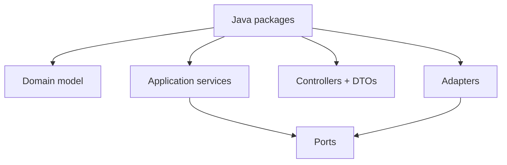
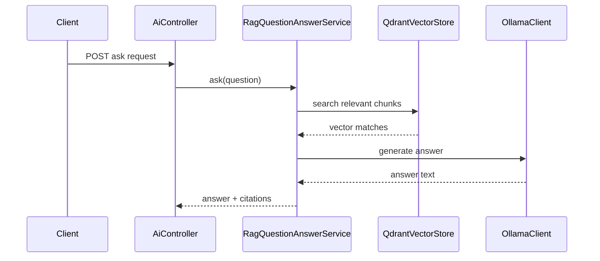

# Java 21 Backend Engineering in MarketMind AI

## Overview

Java is the implementation language for the MarketMind backend. The project uses Java 21 with Spring Boot 3 to build typed domain models, service-layer workflows, persistence adapters, HTTP APIs, schedulers, and AI infrastructure integrations.

## Problem statement

MarketMind needs a backend that can handle financial documents, portfolio imports, source validation, scheduled jobs, RAG workflows, and production-grade observability. The language must support strong typing, maintainable abstractions, mature libraries, and predictable runtime behavior.

## Why Java exists in this architecture

Java gives MarketMind:

| Need | Java strength |
|---|---|
| Large domain model | Records, enums, classes, packages, compile-time safety |
| Enterprise integrations | JDBC, HTTP clients, validation, schedulers, metrics |
| Long-lived services | Mature JVM, profiling, garbage collection, operational tooling |
| Interview relevance | Common in backend, fintech, banking, data platforms |

## Real industry use cases

Java remains common in financial platforms, trading systems, banking APIs, payment gateways, enterprise data pipelines, risk engines, and compliance-heavy systems because teams value stability, observability, and mature dependency ecosystems.

## How MarketMind uses Java

MarketMind uses Java for:

- domain records and enums such as `Document`, `DocumentStatus`, `DiscoveryJob`, `PipelineJobStatus`;
- application services such as `DocumentDownloadService`, `PdfTextExtractionService`, `PipelineOrchestrator`;
- ports such as `Downloader`, `Parser`, `VectorStore`, `SourceConnector`;
- infrastructure adapters such as `JdbcRagRepository`, `QdrantVectorStore`, `OllamaClient`;
- API controllers such as `DocumentController`, `DiscoveryController`, `SourceIntelligenceController`.

## Architecture

The package structure is intentionally modular: each bounded context owns its own domain, application, DTO, mapper, API, and infrastructure packages.

## Internal working

Important Java mechanisms used in the backend:

| Mechanism | MarketMind usage |
|---|---|
| Records | Immutable DTO-like carriers, for example `PipelineStartCommand` and response projections. |
| Enums | State machines: `DownloadStatus`, `ExtractionStatus`, `PipelineStageStatus`. |
| Interfaces | Ports and connector abstractions. |
| Exceptions | Domain and infrastructure failure mapping through `GlobalExceptionHandler`. |
| Generics | Page containers and typed repository responses. |
| Streams | Collection transformations in services and mappers. |

## Request flow

Example: asking a RAG question.

## Lifecycle

Java objects in MarketMind generally follow this lifecycle:

1. HTTP request or scheduler event creates a command/request object.
2. Controller validates and forwards it.
3. Application service creates or loads domain objects.
4. Repository or adapter persists state.
5. Mapper converts domain/application models into response DTOs.

## Best practices

- Keep domain types small and explicit.
- Use enums for controlled states rather than strings.
- Keep controllers thin.
- Put business workflows in application services.
- Keep infrastructure code behind interfaces.
- Prefer immutable records for request/response projections.
- Use package names to communicate architecture.

## Common mistakes

| Mistake | Consequence |
|---|---|
| Putting business logic in controllers | Harder to test and reuse. |
| Passing JPA entities into API responses | Leaks persistence design. |
| Using strings for state | Runtime bugs and weak validation. |
| Catching all exceptions too early | Hides useful error context. |
| Mixing ports and adapters | Breaks hexagonal boundaries. |

## Performance

Java performance in MarketMind is mostly affected by I/O:

- PostgreSQL queries;
- HTTP calls to public sources;
- PDF parsing;
- embedding generation;
- Qdrant indexing/search;
- Ollama inference.

Optimize the slow boundary first. Do not micro-optimize Java loops while the real bottleneck is an external dependency.

## Security

- Validate incoming DTOs with Jakarta Validation.
- Do not log file contents or portfolio details.
- Use `GlobalExceptionHandler` to avoid exposing low-level infrastructure errors.
- Keep secrets out of source code and Docker examples.
- Treat downloaded documents as untrusted input.

## Production considerations

Use Java runtime observability:

- structured logs with correlation IDs;
- Micrometer metrics for pipeline stages;
- JVM memory/CPU monitoring;
- timeout configuration for HTTP clients;
- bounded retries for pipeline stages.

## Scalability

The Java service can scale horizontally when state is externalized in PostgreSQL, Qdrant, Redis, and file/object storage. The current local implementation is suitable for development; production scaling would require external object storage and distributed job coordination.

## Monitoring

Monitor:

- request duration;
- error rate by endpoint;
- pipeline stage duration;
- scheduler run failures;
- JVM heap and GC;
- Qdrant/Ollama failures;
- database connection pool saturation.

## Interview questions

| Level | Question |
|---|---|
| Junior | What is the difference between a class, interface, enum, and record? |
| Mid | Why would you use interfaces for `Downloader` or `VectorStore`? |
| Senior | How do you structure Java packages for a modular monolith? |
| Principal | How do you prevent a Java monolith from becoming a big ball of mud? |

## Principal Engineer questions

- Where should module boundaries be enforced: packages, build modules, runtime services, or ownership?
- When would you split MarketMind into separate services?
- How would you manage versioning of domain events and API DTOs?
- What Java runtime risks matter most for AI/document workloads?

## Follow-up questions

- Why not expose JPA entities directly?
- Why use records for responses?
- How do checked and unchecked exceptions affect service APIs?
- How would you test a Java service without Spring?

## Scenario-based questions

You see pipeline runs stuck in `RUNNING`. What Java-level and system-level checks do you perform?

Expected reasoning: thread pool, blocking HTTP calls, database locks, retry sleep, unhandled exception, missing transaction commit, logs with correlation ID.

## Hands-on exercises

1. Add a new `DocumentStatus` and trace where compilation fails.
2. Write a unit test for a mapper without loading Spring.
3. Add a new port for antivirus scanning downloaded PDFs.
4. Refactor a controller method so it delegates all workflow logic to a service.

## Code walkthrough using MarketMind

| Class | Responsibility | Pattern |
|---|---|---|
| `Company` | Company domain model | Domain model |
| `CompanyService` | Company use cases | Application service |
| `CompanyRepository` | Persistence port | Repository port |
| `CompanyPersistenceAdapter` | Database adapter | Adapter |
| `GlobalExceptionHandler` | Error translation | Controller advice |
| `CorrelationIdFilter` | Request tracing | Servlet filter |

## Assignments

- Explain the document pipeline using only Java package boundaries.
- Create a one-page diagram showing API, application, domain, and infrastructure packages.
- Review one service and identify what would break if it directly used a JDBC client.

## Summary

Java is not just a language choice in MarketMind; it is the foundation for explicit boundaries, testable workflows, typed state machines, and production-friendly backend engineering.

