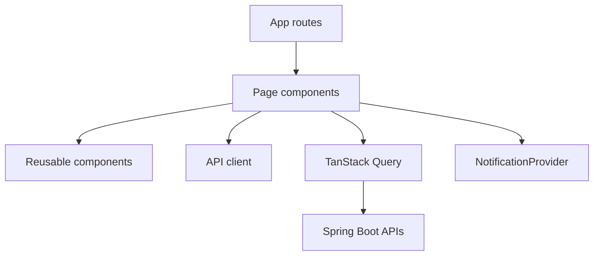
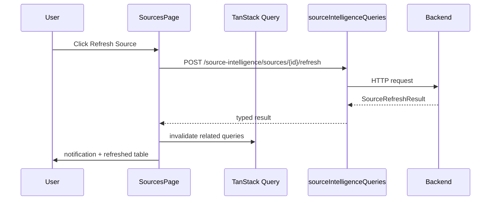

# React + TypeScript Frontend Engineering in MarketMind AI

## Overview

The MarketMind frontend is a React, TypeScript, and Vite application that turns backend capabilities into operational product views: dashboard, source intelligence, discovery, pipeline monitoring, scheduler, portfolio, documents, and research assistant.

## Problem statement

MarketMind performs many background operations. Users need to understand what happened, what is running, what failed, and what to do next. The frontend must make backend state visible without overwhelming the user.

## Why this technology exists

React solves composable UI development. TypeScript adds compile-time safety across API contracts, UI state, and component props. Vite keeps local development fast.

## Real industry use cases

React + TypeScript is common for dashboards, internal platforms, SaaS consoles, data products, monitoring UIs, trading/portfolio views, and AI workbenches.

## How MarketMind uses it

| Area | Files |
|---|---|
| API client | `frontend/src/api/client.ts` |
| API types | `frontend/src/api/types.ts` |
| App shell/navigation | `frontend/src/components/AppShell.tsx` |
| Dashboard | `frontend/src/pages/DashboardPage.tsx` |
| Discovery | `frontend/src/pages/DiscoveryPage.tsx` |
| Pipeline monitor | `frontend/src/pages/PipelineMonitorPage.tsx` |
| Source intelligence | `frontend/src/pages/SourcesPage.tsx` |
| Notifications | `frontend/src/notifications/NotificationProvider.tsx` |

## Architecture

## Internal working

The UI uses:

- typed API response interfaces;
- reusable layout components (`PageHeader`, `SectionCard`, `MetricCard`, `StatusChip`);
- polling for operational pages;
- mutation hooks for actions like discovery run, refresh, validation, retry;
- notification state for events users should not miss.

## Request flow

## Lifecycle

1. Page mounts.
2. Query loads data.
3. User triggers an action.
4. Mutation calls backend.
5. Query cache invalidates.
6. Page re-renders with fresh data.
7. Notification center records important outcome.

## Best practices

- Type API responses.
- Keep reusable UI primitives small.
- Use clear empty states.
- Use polling only for operational views.
- Give every background action a visible result.
- Avoid silent failures.
- Keep product language specific: “no direct PDFs found” is better than “no data.”

## Common mistakes

| Mistake | Why it hurts |
|---|---|
| Generic empty states | Users cannot recover. |
| Untyped API payloads | Breaks appear late. |
| Toast-only notifications | Important events disappear. |
| Polling every page aggressively | Wastes browser and backend resources. |
| UI labels hiding mock/seeded status | Misleads operators. |

## Performance

Frontend performance concerns:

- table size and rendering cost;
- polling frequency;
- bundle size;
- repeated query invalidations;
- chart rendering;
- unnecessary state duplication.

The MarketMind UI uses auto-refresh on discovery, pipeline, portfolio prices, and source activity because those screens represent background work.

## Security

- Do not display secrets.
- Avoid rendering raw HTML from crawled pages.
- Use `rel="noreferrer"` on external links.
- Keep file upload UX explicit.
- Do not expose portfolio financial details in logs or notifications.

## Production considerations

Production UI should include:

- backend URL configuration;
- auth/session handling when added;
- error boundary;
- monitoring for frontend errors;
- controlled polling intervals;
- accessibility review for tables and status chips.

## Scalability

As data grows, add server-side pagination, table virtualization, filtering, and event streaming. Current pages are suited for local and early product usage.

## Monitoring

Monitor:

- failed API calls;
- slow pages;
- source/pipeline notification volume;
- user actions that repeatedly fail;
- frontend build size.

## Interview questions

| Level | Question |
|---|---|
| Junior | What problem does TypeScript solve in React? |
| Mid | How does query invalidation work after a mutation? |
| Senior | How do you design operational UI for background jobs? |
| Principal | How would you evolve this UI into a multi-tenant enterprise console? |

## Principal Engineer questions

- Should background updates use polling, SSE, or WebSockets?
- How do you prevent UI optimism from misrepresenting backend state?
- What is the right boundary between product state, server state, and local UI state?
- How do you design a notification system that helps without becoming noise?

## Follow-up questions

- Why use typed API clients instead of inline `fetch`?
- How should the UI handle partial failures?
- What should happen if pipeline status changes while a drawer is open?
- How do you test a warning state for zero discovery results?

## Scenario-based questions

Discovery ran successfully but found zero PDFs from NSE. What should the UI show?

Expected answer: warning state, crawler diagnostics, reason, recommendation, source-specific crawler note, and next actions.

## Hands-on exercises

1. Add a typed API method for a new backend endpoint.
2. Add an empty state explaining why a table is blank.
3. Add a notification for a successful pipeline retry.
4. Add an auto-refresh interval only while a job is running.

## Code walkthrough using MarketMind

| File | Responsibility |
|---|---|
| `SourcesPage.tsx` | Source catalog, coverage, activity, connector operations. |
| `DiscoveryPage.tsx` | Discovery runs, zero-result warnings, documents. |
| `PipelineMonitorPage.tsx` | Stage timeline and retry operations. |
| `NotificationProvider.tsx` | Toast plus persistent notification center data. |
| `StatusChip.tsx` | Consistent operational status language. |

## Assignments

- Redesign one empty state so it explains cause and next action.
- Add a frontend test plan for discovery zero-result behavior.
- Draw the flow from user action to backend mutation to notification.

## Summary

React + TypeScript turns MarketMind from backend capability into an understandable operating system. The UI’s job is not just to display data; it must explain background work, failure, and recovery.

