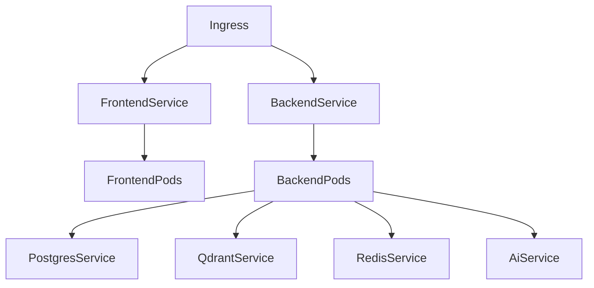
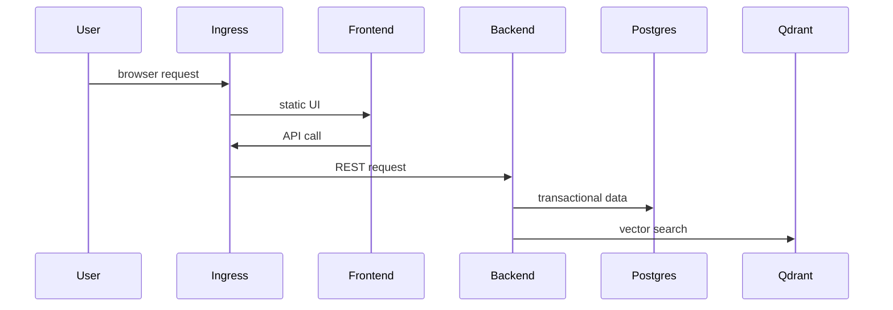

# Kubernetes and Helm Readiness in MarketMind AI

## Overview

MarketMind includes Helm chart assets under `helm/marketmind-ai`. This means the repository has deployment intent for Kubernetes, but the current academy should treat Kubernetes as deployment readiness rather than an already proven production runtime.

## Problem statement

Local Docker Compose is excellent for development, but production platforms often need scheduling, service discovery, rolling deployments, secrets, config maps, persistent volumes, probes, and horizontal scaling.

## Why Kubernetes and Helm exist

Kubernetes orchestrates containers. Helm packages Kubernetes manifests into configurable releases.

| Problem | Kubernetes/Helm answer |
|---|---|
| Run containers reliably | Deployments, StatefulSets, Services |
| Configure environments | ConfigMaps, Secrets, values files |
| Expose services | Services and Ingress |
| Persist state | PersistentVolumeClaims |
| Release repeatably | Helm chart templates |

## Real industry use cases

Teams use Kubernetes for SaaS platforms, data APIs, internal developer platforms, AI services, event processors, and microservice estates. Helm is common when the same app must run across dev, staging, and production with different values.

## How MarketMind uses it

The chart includes templates for:

- backend deployment and service;
- frontend deployment and service;
- AI service deployment and service;
- PostgreSQL StatefulSet and service;
- Qdrant StatefulSet and service;
- Redis deployment and service;
- config map, secret, and ingress.

## Architecture

## Internal working

Kubernetes separates desired state from runtime state. A Deployment says “run N backend pods.” The control plane reconciles actual pods toward that desired state. Helm renders the YAML from templates and values.

## Request flow

## Lifecycle

1. Helm renders manifests.
2. Kubernetes applies desired state.
3. Pods start and become ready.
4. Services route traffic.
5. Rolling updates replace pods gradually.
6. Failed pods are restarted.

## Best practices

- Keep secrets out of values committed to Git.
- Use readiness and liveness probes.
- Put stateful dependencies on managed services in production when possible.
- Define resource requests and limits.
- Keep local Docker Compose and Helm values aligned.
- Validate manifests in CI before deployment.

## Common mistakes

| Mistake | Risk |
|---|---|
| Running production DB without backup plan | Data loss |
| No probes | Traffic reaches unhealthy pods |
| No resource limits | Noisy-neighbor outages |
| Hardcoded local URLs | Broken deployments |
| Treating Helm as magic | Unreviewed YAML drift |

## Performance

Kubernetes does not make code faster by itself. It helps scale replicas and isolate resources. Bottlenecks still live in database queries, Qdrant, Ollama inference, PDF extraction, and network calls.

## Security

- Use Kubernetes Secrets or external secret managers.
- Restrict ingress exposure.
- Use network policies where possible.
- Run containers as non-root.
- Avoid mounting host paths in production.

## Production considerations

Before production, MarketMind needs:

- production image build pipeline;
- health/readiness endpoints wired into probes;
- persistent storage strategy;
- backup/restore plan;
- logging pipeline;
- environment-specific values;
- secret management;
- TLS ingress.

## Scalability

Scale stateless services horizontally. Scale PostgreSQL, Qdrant, Redis, and Ollama deliberately because each has state, memory, or specialized resource constraints.

## Monitoring

Monitor pod restarts, CPU, memory, readiness failures, ingress latency, database connections, Qdrant latency, and backend error rate.

## Interview questions

| Level | Question |
|---|---|
| Junior | What is a Pod? |
| Mid | Why use a Service in front of pods? |
| Senior | How do readiness probes affect rolling deployments? |
| Principal | Which MarketMind components should be managed services instead of in-cluster stateful workloads? |

## Principal Engineer questions

- How would you design multi-environment Helm values?
- How would you migrate from Docker Compose to Kubernetes without breaking local development?
- What is your stateful workload strategy for PostgreSQL and Qdrant?
- How would you handle Ollama GPU scheduling if added later?

## Follow-up questions

- What belongs in a ConfigMap vs Secret?
- Why might Redis be a Deployment but PostgreSQL a StatefulSet?
- How does Helm rollback work?
- How do you debug a CrashLoopBackOff?

## Scenario-based questions

Backend pods are ready but RAG requests fail. What do you check?

Expected reasoning: service DNS, Qdrant service, Ollama service, config map values, network policy, logs with correlation ID, readiness probes not covering dependencies.

## Hands-on exercises

1. Inspect `helm/marketmind-ai/templates/backend-deployment.yaml`.
2. Add a readiness probe design for backend.
3. Create a values matrix for local, staging, and production.
4. Write a runbook for rolling back a failed release.

## Code walkthrough using MarketMind

| File | Responsibility |
|---|---|
| `helm/marketmind-ai/Chart.yaml` | Chart metadata. |
| `helm/marketmind-ai/values.yaml` | Default deploy configuration. |
| `backend-deployment.yaml` | Backend pod template. |
| `qdrant-statefulset.yaml` | Vector database stateful workload. |
| `ingress.yaml` | External route template. |

## Assignments

- Compare Docker Compose and Helm service definitions.
- Identify which values must differ by environment.
- Propose production hardening changes for the current chart.

## Summary

Kubernetes and Helm are the path from local container orchestration to repeatable platform deployment. In MarketMind today, they represent deployment readiness, not yet a fully operated production environment.

