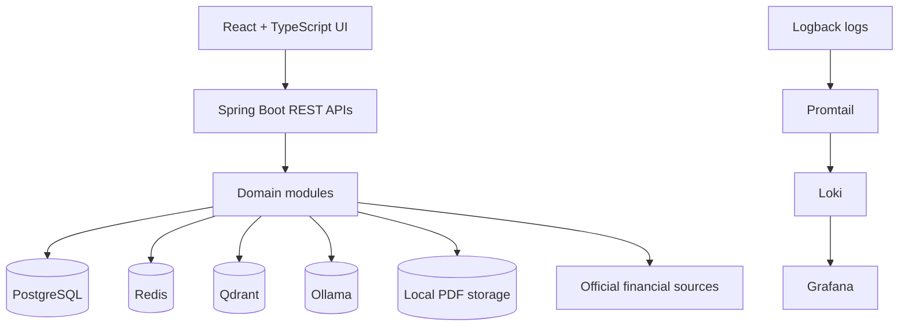
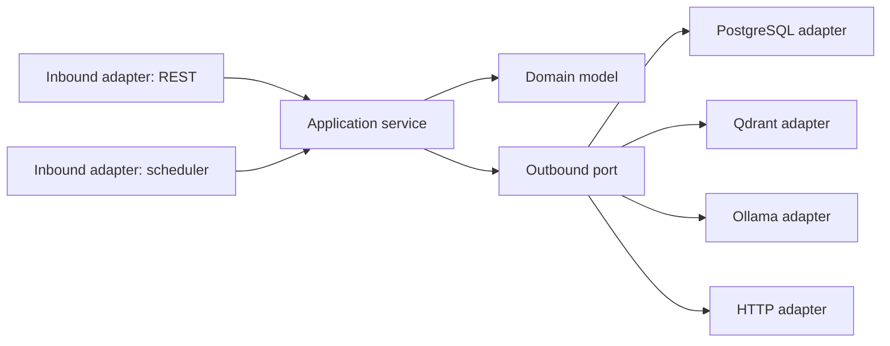
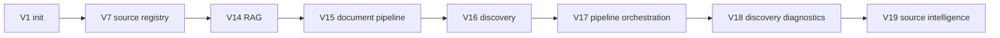
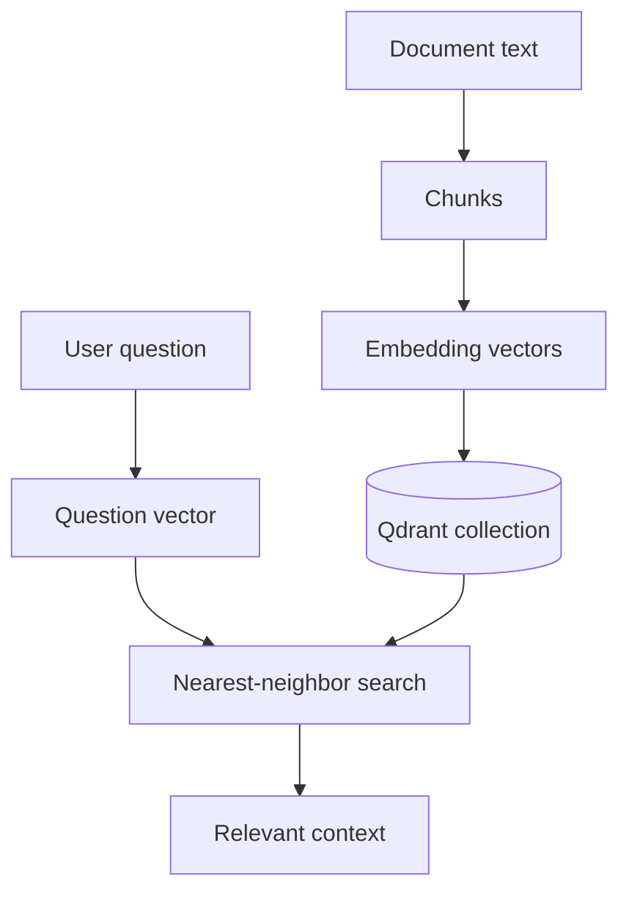

# MarketMind AI System Design Decision Guide

This guide explains why the implemented architecture uses its current technologies and patterns. It is designed for system design interviews, architecture reviews, and Principal Engineer-level trade-off discussions.

## Current system context

## Decision matrix

| Decision | Why MarketMind chose it | Alternatives | Trade-off |
|---|---|---|---|
| Hexagonal Architecture | Keeps domain/application logic independent from HTTP, JDBC, Qdrant, Ollama, and file storage. | Layered MVC, microservices-first | More packages/classes, but better testability. |
| DDD-style modules | Financial documents, discovery, portfolio, market data, and AI have distinct language. | Single shared service package | More explicit boundaries, less accidental coupling. |
| PostgreSQL | Strong relational consistency for jobs, documents, versions, sources, portfolios. | MySQL, MongoDB | SQL rigor and transactions; schema evolution required. |
| Flyway | Repeatable database migration history. | Hibernate auto-DDL, Liquibase | Manual SQL discipline; safer production changes. |
| Qdrant | Purpose-built vector search for RAG chunks. | PostgreSQL pgvector, Pinecone, Weaviate | Local-first vector DB; another dependency to operate. |
| Redis | Local infrastructure foundation for caching/coordination extensions. | In-memory cache, no cache | Operational dependency; useful for future distributed coordination. |
| Ollama | Local LLM inference without cloud dependency. | OpenAI/Anthropic APIs, hosted models | Local privacy/control; quality and latency depend on local model/hardware. |
| Docker Compose | Reproducible local infrastructure. | Manual installs, Kubernetes only | Great local DX; not production orchestration. |
| Scheduler | Runs repeatable background operations like refresh/discovery. | Cron, external workflow engine | Simple app-integrated jobs; needs careful visibility. |
| Discovery Engine | Finds official documents before ingestion. | Manual URL entry only, full scraper | Safer staged ingestion; crawler limitations exist. |
| Pipeline Orchestration | Automates download → extraction → embedding → AI-ready. | Manual endpoint sequence | Better UX and consistency; needs retries/visibility. |
| Observability | Correlation IDs, structured logs, Loki/Grafana make background work debuggable. | Terminal logs only | More config, dramatically better supportability. |

## Why Hexagonal Architecture

MarketMind integrates many unstable boundaries: official websites, PDFs, Qdrant, Ollama, local storage, PostgreSQL, and UI calls. Hexagonal Architecture protects the core workflow from these details.

### Interview answer

“We use hexagonal architecture because the business workflow should be stable while infrastructure changes. For example, `RagQuestionAnswerService` should not care if vector search is Qdrant today and another vector store tomorrow. The port captures the capability; the adapter handles the vendor.”

## Why DDD

MarketMind has multiple bounded contexts:

| Context | Core language |
|---|---|
| Source Registry | source, capability, health, validation |
| Source Intelligence | connector, trust, freshness, coverage, activity |
| Discovery | discovered document, crawler/connector, deduplication |
| Documents | document, version, download job, extraction |
| Pipeline | job, stage, event, retry, correlation ID |
| AI/RAG | chunk, embedding, citation, answer |
| Portfolio | holding, import job, allocation, valuation |
| Market Data | price provider, price snapshot, refresh job |
| Scheduler | job, run, execution mode, implementation status |

DDD helps each area evolve without forcing one generic “DocumentService” to mean everything.

## Why PostgreSQL

PostgreSQL stores durable operational state:

- registered sources;
- documents and versions;
- download jobs;
- text extraction records;
- embedding jobs/chunks;
- discovery jobs/documents/source runs;
- pipeline jobs/stages/events;
- portfolio imports/holdings;
- price refresh jobs;
- scheduler jobs/runs.

Use PostgreSQL when the question is: “What happened, when, and what is the current state?”

## Why Flyway

Flyway makes database evolution explicit. MarketMind has schema-bearing features across many sprints. Migration files are a historical ledger of product evolution.

## Why Qdrant and vector search

Traditional SQL search is poor at semantic similarity. RAG needs to find chunks that mean the same thing as the user’s question, even if words differ.

## Why Redis

Redis is present in local infrastructure and is appropriate for future cache, rate-limit, distributed lock, and queue-adjacent use cases. The academy should not claim Redis is deeply used for a feature that is not currently implemented.

## Why Ollama

Ollama allows local LLM calls for research assistant workflows. It keeps early development independent from cloud LLM billing and secrets.

## Why Docker Compose

Docker Compose gives developers a single local stack for PostgreSQL, Redis, Qdrant, pgAdmin, Loki, Promtail, and Grafana. It solves onboarding friction.

## Why Scheduler

MarketMind has background concerns: price refresh, discovery, validation, and pipeline work. Scheduler abstractions make these visible through APIs and UI rather than hiding them in ad hoc scripts.

## Why Discovery Engine

Discovery separates “found a possible official document” from “downloaded and ingested it.” This is safer than immediately scraping/downloading everything.

## Why RAG

MarketMind answers questions grounded in documents. RAG is used because the model alone cannot reliably know the current content of company documents stored in this system.

## Why embeddings and chunking

PDFs are too large to send whole to a model. Chunking splits text into retrievable pieces. Embeddings make those pieces searchable by meaning.

## Why pipeline orchestration

Manual sequencing is fragile:

1. download;
2. extract;
3. chunk;
4. embed;
5. index;
6. summarize;
7. mark AI-ready.

The orchestrator records stage starts, ends, duration, retries, failures, and events.

## Why observability and correlation IDs

Background-heavy systems fail in non-obvious ways. Correlation IDs let engineers connect a user-visible error, API logs, pipeline events, and downstream dependency failures.

## Whiteboard prompt

Design “MarketMind AI document intelligence” from source discovery to AI answer.

Expected blocks:

- source registry;
- connector/discovery;
- document metadata;
- downloader/storage/versioning;
- extraction;
- chunking/embedding;
- vector database;
- retriever;
- LLM;
- citation persistence;
- pipeline orchestration;
- logs/metrics/correlation IDs;
- UI operating views.

## Principal Engineer trade-offs

| Question | Strong answer |
|---|---|
| Why not microservices now? | Modular monolith is faster and safer until bounded contexts need independent scaling/deployment. |
| What is the hardest scaling bottleneck? | LLM inference, embedding throughput, PDF parsing, and vector indexing before ordinary REST traffic. |
| What is the hardest reliability issue? | External source variability and multi-stage background workflows. |
| What must be added before production? | Auth, secret management, object storage, backup/restore, alerting, distributed job coordination, rate limiting. |

