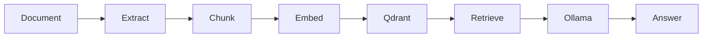

# MarketMind AI One-Page Cheat Sheets

## Java 21

| Concept | Remember |
|---|---|
| Record | Immutable data carrier; good for commands/responses. |
| Enum | Use for controlled states like `PipelineStageStatus`. |
| Interface | Use for ports like `VectorStore`, `Downloader`, `SourceConnector`. |
| Exception | Map through `GlobalExceptionHandler`; do not leak low-level details. |

Interview line: “In MarketMind, Java types encode business state so invalid states are harder to represent.”

## Spring Boot

| Layer | MarketMind example |
|---|---|
| Controller | `DiscoveryController` |
| Application service | `DiscoveryService` |
| Domain | `DiscoveredDocument` |
| Repository port | `DiscoveryRepository` |
| Adapter | `JdbcDiscoveryRepository` |

Interview line: “Controllers translate HTTP; services own use cases.”

## REST

| Use | Pattern |
|---|---|
| List | `GET /api/v1/...` with pagination |
| Detail | `GET /api/v1/.../{id}` |
| Command | `POST /api/v1/...` |
| Error | `type/title/status/detail/code/correlationId/timestamp` |

## PostgreSQL

| Strength | MarketMind usage |
|---|---|
| Transactions | document/job consistency |
| Indexes | lookup jobs/documents/sources |
| JSONB | source formats/document types metadata |
| Constraints | valid source intelligence scores |

## Flyway

Rules:

- never edit applied migrations in shared environments;
- add a new versioned migration;
- keep migrations deterministic;
- test from an empty database.

## Docker Compose

MarketMind local stack:

- PostgreSQL;
- Redis;
- Qdrant;
- pgAdmin;
- Loki;
- Promtail;
- Grafana.

## RAG

Flow:



Rule: retrieval quality limits answer quality.

## Qdrant

Use Qdrant when semantic similarity matters. Store embeddings plus metadata needed to trace back to document chunks and citations.

## REST Validation

Common errors:

- validation failed;
- invalid enum;
- missing parameter;
- unreadable JSON;
- multipart upload failure.

Always return actionable messages.

## Scheduler

Scheduler jobs need:

- execution mode;
- implementation status;
- run history;
- duration;
- result summary;
- clear mock/seeded labels.

## Logging and Correlation ID

Every request should have:

- `X-Correlation-Id` response header;
- MDC `correlationId`;
- request start log;
- request completion log with status/duration.

Loki query:

```logql
{job="marketmind-backend"} |= "correlationId"
```

## Pipeline

Stages:

`DISCOVERY → DOWNLOAD → TEXT_EXTRACTION → CHUNKING → EMBEDDING → INDEXING → SUMMARY → AI_READY`

Track status, retries, start/end, duration, and events.

