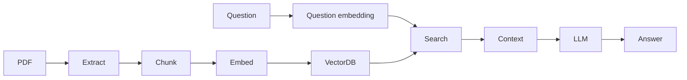

# MarketMind AI Complete Interview Handbook

Use this handbook to prepare for backend, system design, Principal Engineer, Solution Architect, AI Engineer, Engineering Manager, and production support interviews.

## How to tell the MarketMind story

> “MarketMind AI is a modular Spring Boot and React platform for financial intelligence. It manages official sources, validates them, discovers documents, downloads and versions PDFs, extracts text, chunks and embeds content, indexes vectors in Qdrant, answers questions using RAG with Ollama, imports portfolios, refreshes market prices, and exposes background work through scheduler, pipeline, dashboard, source intelligence, logging, and notifications.”

## Interview topic matrix

| Topic | Junior | Mid | Senior | Principal |
|---|---|---|---|---|
| Java 21 | Syntax, records, enums | Interfaces, exceptions | package boundaries, testing | modular monolith governance |
| Spring Boot | controllers/services | validation/config | transactions/errors | platform conventions |
| REST | verbs/status codes | pagination/errors | API evolution | API governance |
| PostgreSQL | tables/indexes | transactions | query design | data ownership and migrations |
| Flyway | migrations | ordering/rollback | zero-downtime schema | governance across teams |
| Docker | containers | compose networking | local parity | platform strategy |
| React/TypeScript | components/types | query/mutations | operational UX | enterprise console design |
| Source Registry | CRUD | validation | trust/source health | official-source strategy |
| Discovery | PDF link discovery | dedup/classification | crawler diagnostics | connector roadmap |
| Pipeline | stages/status | retries/events | idempotency | workflow architecture |
| RAG | retrieve + generate | chunks/embeddings | hallucination control | AI system risk |
| Observability | logs | correlation IDs | searchable logs/metrics | incident strategy |

## Backend interview questions

### Junior

- What is a REST controller?
- What is a DTO?
- Why use validation annotations?
- What is a repository?
- What is the difference between a domain object and a database entity?

### Mid

- How does a request flow from controller to repository?
- Why does MarketMind use mappers?
- How are invalid enum values handled?
- What does Flyway do at startup?
- How do you test a service without hitting the database?

### Senior

- Explain the document download flow.
- How would you make the pipeline retry-safe?
- Where should transaction boundaries live?
- How would you prevent duplicate discovered documents?
- How do you handle external service failures without leaking internals?

### Principal

- When should MarketMind split into services?
- Which modules need independent scaling first?
- How would you design ownership boundaries for source intelligence, documents, and AI?
- What production risks exist in local-first AI infrastructure?
- How would you define platform standards for all future modules?

## System design questions

### Whiteboard: design RAG for financial PDFs

Expected answer:

Discuss:

- chunk size and overlap;
- embedding model choice;
- citation tracking;
- hallucination control;
- re-indexing;
- privacy and access control;
- cost and latency.

### Whiteboard: design source discovery

Expected answer:

- source registry;
- connector factory;
- official-source prioritization;
- crawler diagnostics;
- deduplication;
- document classification;
- no automatic download unless approved by pipeline policy;
- UI visibility for zero-result runs.

## AI Engineer questions

| Category | Questions |
|---|---|
| Embeddings | What is an embedding? Why chunk before embedding? |
| Vector search | Why Qdrant instead of SQL LIKE? |
| RAG | How does RAG reduce hallucination? |
| Evaluation | How would you evaluate answer quality? |
| Failure | What happens when Ollama is unavailable? |
| Production | How do you monitor embedding and retrieval quality? |

## Solution Architect questions

- How would you deploy MarketMind for a small finance team?
- How would you secure document ingestion?
- What managed services would you choose in production?
- How do you separate local development from cloud deployment?
- How would you support multiple tenants?

## Engineering Manager questions

- How would you break this roadmap into teams?
- Which modules need ownership?
- How do you set engineering quality bars?
- How do you prioritize observability work against feature delivery?
- How would you onboard new engineers using the academy?

## Production support questions

- A user says AI answers are stale. What do you check?
- Discovery finds zero documents for NSE. Is that a failure?
- Pipeline fails at embedding. What logs and tables do you inspect?
- Qdrant is down. What user-facing behavior is acceptable?
- PostgreSQL migrations fail on startup. What is your recovery plan?

## Coding questions

1. Write a URL normalization function for discovered document deduplication.
2. Implement a retry helper with exponential backoff.
3. Map validation errors into a field error response.
4. Create a mapper from domain object to DTO.
5. Write a unit test for document classification by keyword.

## Code review questions

- Is business logic in the controller?
- Are exceptions mapped consistently?
- Is the new persistence code hiding behind a port?
- Are retries bounded?
- Is sensitive data logged?
- Does the UI explain empty/error states?

## Behavioral questions

- Tell me about a time you improved production visibility.
- Tell me about a time you pushed back on premature microservices.
- Tell me about a time you designed for failure.
- Tell me about a time you taught a complex concept to a team.

## Trade-off questions

| Trade-off | Good answer shape |
|---|---|
| Modular monolith vs microservices | Start simple, keep extraction seams. |
| Qdrant vs pgvector | Pick based on vector workload maturity and ops tolerance. |
| Polling vs events | Polling is simple; events scale better for live operations. |
| Local LLM vs hosted LLM | Privacy/dev simplicity vs quality/latency/ops. |
| Generic crawler vs source connector | Generic is broad; connectors are reliable and source-aware. |

