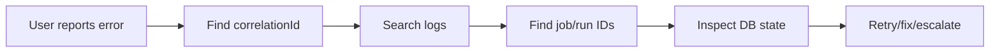

# MarketMind AI Production Support Runbook

This runbook teaches how to operate and debug the implemented MarketMind system.

## First principles

1. Start with user-visible symptom.
2. Capture correlation ID if available.
3. Check dashboard/source/pipeline/scheduler UI state.
4. Search logs.
5. Inspect durable state in PostgreSQL.
6. Check dependent systems: Qdrant, Ollama, source website, file storage.
7. Decide whether to retry, ignore, fix data, or patch code.

## Log investigation

Local logs:

- backend console;
- `logs/marketmind-backend.log`;
- Grafana Explore via Loki.

Example Loki queries:

```logql
{job="marketmind-backend"} |= "correlationId"
{container_name="marketmind-postgres"}
{job="marketmind-backend"} |= "Pipeline stage failed"
{job="marketmind-backend"} |= "QDRANT_FAILURE"
```

## Metrics to watch

| Area | Signals |
|---|---|
| REST APIs | request count, status, duration |
| Pipeline | job count, stage duration, retries, failures |
| Discovery | total discovered, zero-result runs, failed sources |
| Qdrant | availability, query latency, indexing failures |
| Ollama | generation latency, connection failures |
| PostgreSQL | connection pool, slow queries, locks |
| Scheduler | run status, duration, last run message |

## Tracing with correlation ID



## Failure: Discovery completed with zero documents

### Symptom

Discovery job status is completed, but `totalDiscovered = 0`.

### Likely causes

- HTML fetched but no direct PDF links found.
- Page is dynamic.
- Page is protected.
- Source requires a source-specific connector.
- URL is not a document listing page.

### Checks

- `sourceReachable`
- `htmlFetched`
- `httpStatus`
- `linksScanned`
- `pdfLinksFound`
- `reasonWhenZeroResults`
- source URL domain, especially NSE.

### Action

Try `TEST_SOURCE`, try a direct company annual report page, or create/improve a source-specific connector.

## Failure: Document download failed

### Likely causes

- URL unreachable.
- Timeout.
- Unsupported content type.
- File too large.
- Storage path issue.
- Checksum/version conflict.

### Check classes

- `DocumentDownloadService`
- `HttpDocumentDownloader`
- `LocalFileStorageProvider`
- `Sha256ChecksumService`

### Action

Validate source URL, retry if transient, mark failed if source is bad.

## Failure: PDF extraction failed

### Likely causes

- Corrupted PDF.
- Scanned image PDF with no text layer.
- PDFBox parsing error.
- File missing from storage.

### Check classes

- `PdfTextExtractionService`
- `PdfBoxDocumentParser`
- `JdbcDocumentTextExtractionRepository`

### Action

Retry if file/storage issue. If scanned PDF, future OCR capability is needed; do not pretend extraction succeeded.

## Failure: Embedding failed

### Likely causes

- Ollama unavailable.
- Embedding model missing.
- Text too large for provider.
- Network/timeout.

### Check classes

- `DocumentEmbeddingService`
- `TextChunkingService`
- `OllamaClient`
- `JdbcRagRepository`

### Action

Check Ollama health, model availability, chunk sizes, and embedding job status.

## Failure: Qdrant indexing/search failed

### Likely causes

- Qdrant container down.
- Collection missing or incompatible.
- Vector dimension mismatch.
- Network timeout.

### Check classes

- `QdrantVectorStore`
- `AiInfrastructureConfiguration`
- `GlobalExceptionHandler`

### Action

Restart Qdrant locally, verify collection config, re-run embedding/indexing stage.

## Failure: AI Q&A returns weak answer

### Likely causes

- Document not AI-ready.
- Chunks missing.
- Embeddings missing.
- Retrieval returns poor context.
- Prompt/model limitation.

### Checks

- document status;
- embedding job status;
- Qdrant search results;
- citations;
- extracted text quality.

## Failure: Scheduler confusion

### Symptom

User cannot tell if a job is mock, seeded, real, or manually executable.

### Checks

- `executionMode`
- `implementationStatus`
- `lastRunMessage`
- `run history`

### Action

Never show static seeded values without labels. Run Now should return a meaningful result summary.

## PostgreSQL issues

| Symptom | Check |
|---|---|
| App fails startup | Flyway migration error |
| Slow API | missing index, slow query |
| Job stuck | transaction not committed, lock |
| Duplicate data | unique constraints/dedup logic |

## Deadlocks and slow queries

Investigation order:

1. Identify endpoint/job.
2. Check query pattern.
3. Check transaction scope.
4. Check indexes.
5. Check concurrent updates.
6. Add idempotency or narrower locks if needed.

## CPU and memory

High CPU may come from PDF parsing, embedding generation, or frontend build. High memory may come from large PDFs, too-large chunks, or holding file bytes too long.

## Retry rules

Retries are appropriate for transient dependency failures. Retries are harmful for deterministic failures like invalid URL, unsupported document type, or bad input.

| Failure | Retry? |
|---|---|
| HTTP timeout | Yes, bounded |
| Qdrant temporarily unavailable | Yes |
| Invalid enum | No |
| Scanned PDF without OCR | No, needs new capability |
| Duplicate URL | No, mark existing |

## Incident response template

| Field | Content |
|---|---|
| Incident | What failed? |
| User impact | Who/what was affected? |
| Correlation ID | Request or pipeline correlation ID |
| Timeline | Started, detected, mitigated, resolved |
| Root cause | Technical cause |
| Contributing factors | Missing alerts, unclear UI, bad retry |
| Fix | Code/config/data action |
| Prevention | Test, metric, alert, runbook update |

## Future production hardening

Not yet fully implemented, but important future work:

- circuit breakers;
- distributed locks;
- persistent object storage;
- auth/RBAC;
- alert routing;
- OCR for scanned PDFs;
- queue-backed pipeline execution;
- production Kubernetes readiness.

