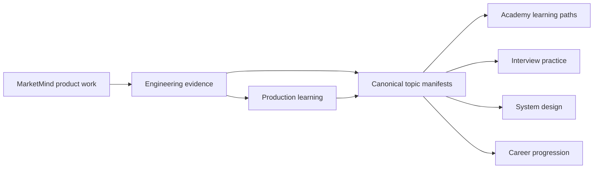
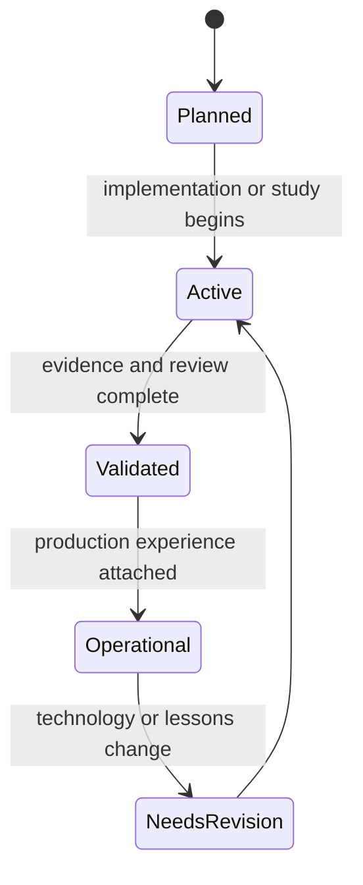

# MarketMind Engineering Knowledge System

The **MarketMind Engineering Knowledge System (MEKS)** is the canonical,
long-term knowledge layer for MarketMind AI. It connects product delivery,
engineering education, architecture, production learning, and career growth.

MEKS is not a collection of independent books. It is an evidence graph:



## System Layers

| Layer | Location | Responsibility |
|---|---|---|
| Canonical knowledge | `knowledge/topics/` | Topic ownership, status, prerequisites, evidence, mastery |
| Narrative learning | `academy/` | Progressive explanations and guided curricula |
| Product architecture | `architecture/`, `docs/`, `decision-records/` | Current system design and decisions |
| Practice | `labs/`, `assignments/`, `quizzes/`, `flashcards/` | Deliberate hands-on learning |
| Operations | `production/`, `case-studies/` | Incidents, runbooks, failure analysis |
| Career development | `roadmaps/` | Role paths, study plans, skill evidence |
| Discovery | `knowledge/indexes/`, `knowledge/graphs/` | Navigation and dependency views |

## Topic Lifecycle



## Source-of-Truth Rules

1. A concept has one canonical topic manifest under `knowledge/topics/`.
2. Academy chapters teach; they link to the manifest rather than copying its
   governance metadata.
3. Product documents describe the current MarketMind system, not generic
   theory.
4. Progress requires evidence such as code, tests, ADRs, dashboards,
   benchmarks, incident exercises, or technical explanations.
5. Interview readiness and production readiness are tracked separately.
6. Time-sensitive claims include a review date and preferably a primary source.
7. Secrets, credentials, proprietary data, and broker exports never belong in
   the knowledge system.

## Start Here

- [Master Index](./indexes/MASTER_INDEX.md)
- [Skill Matrix](./indexes/SKILL_MATRIX.md)
- [Progress Tracker](./indexes/PROGRESS_TRACKER.md)
- [Knowledge Graph](./graphs/KNOWLEDGE_GRAPH.md)
- [Dependency Graph](./graphs/DEPENDENCY_GRAPH.md)
- [MarketMind Index](./indexes/MARKETMIND_INDEX.md)
- [Contribution Guide](./CONTRIBUTING.md)
- [Metadata Standard](./metadata/README.md)

## Maintenance

Run the idempotent scaffolder after adding a catalog entry:

```bash
python3 scripts/meks/generate_meks.py
```

The generator creates missing skeletons only. It does not overwrite developed
topic content.
