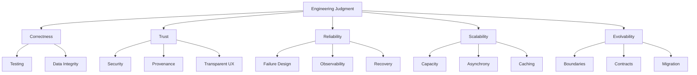

# MEKS Concept Graph

Use this graph to connect technologies to quality attributes. For example,
Qdrant is not learned in isolation; it participates in provenance, retrieval
quality, scalability, failure design, and operations.
