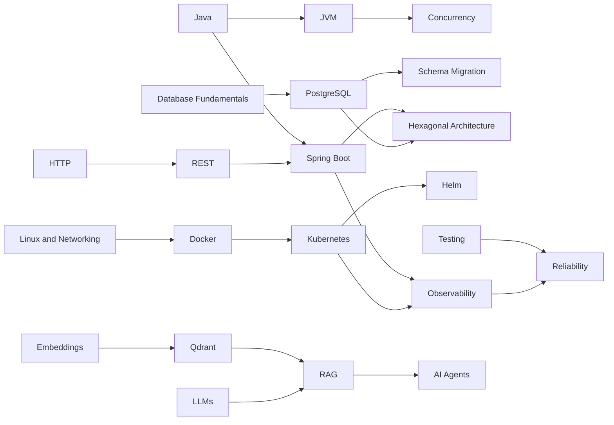

# MEKS Dependency Graph

## Dependency Policy

- A prerequisite may be satisfied through demonstrated experience.
- Topic manifests should link only meaningful dependencies.
- Circular relationships are allowed in advanced learning but should not hide
  the first useful entry point.
