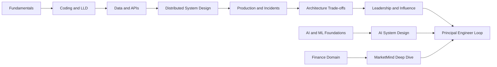

# MEKS Interview Graph

```mermaid
flowchart LR
    F[Fundamentals] --> C[Coding and LLD]
    C --> D[Data and APIs]
    D --> DS[Distributed System Design]
    DS --> P[Production and Incidents]
    P --> A[Architecture Trade-offs]
    A --> L[Leadership and Influence]
    L --> PE[Principal Engineer Loop]
    ML[AI and ML Foundations] --> AI[AI System Design]
    AI --> PE
    FIN[Finance Domain] --> MM[MarketMind Deep Dive]
    MM --> PE
```

Strong answers should combine a mental model, a trade-off, a failure scenario,
and concrete MarketMind evidence.
