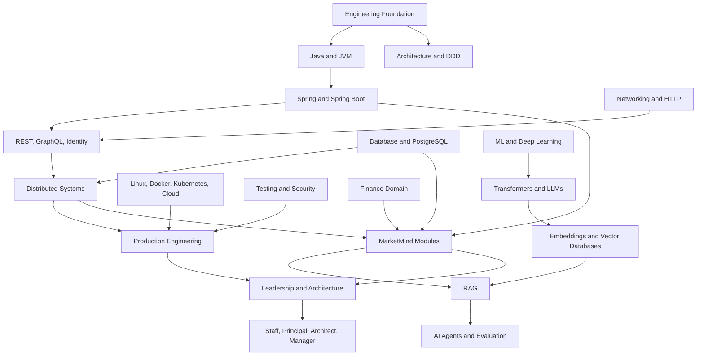

# MEKS Knowledge Graph

## Reading the Graph

Arrows express strong learning dependencies, not mandatory bureaucracy.
Experienced engineers may enter at any node, but should verify upstream mental
models before claiming production mastery.
