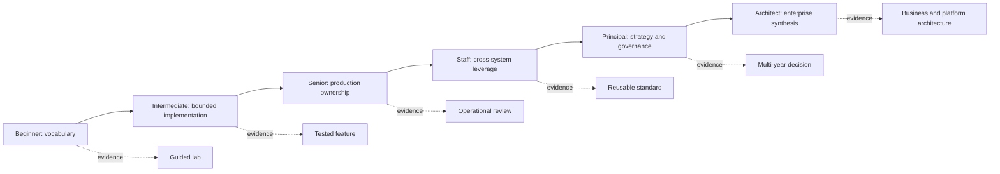

# MEKS Learning Graph

```mermaid
flowchart LR
    B[Beginner: vocabulary] --> I[Intermediate: bounded implementation]
    I --> S[Senior: production ownership]
    S --> ST[Staff: cross-system leverage]
    ST --> P[Principal: strategy and governance]
    P --> A[Architect: enterprise synthesis]

    B -. evidence .-> E1[Guided lab]
    I -. evidence .-> E2[Tested feature]
    S -. evidence .-> E3[Operational review]
    ST -. evidence .-> E4[Reusable standard]
    P -. evidence .-> E5[Multi-year decision]
    A -. evidence .-> E6[Business and platform architecture]
```

Progress is nonlinear. Engineers revisit foundational topics with deeper
production, organizational, and strategic questions at each level.
