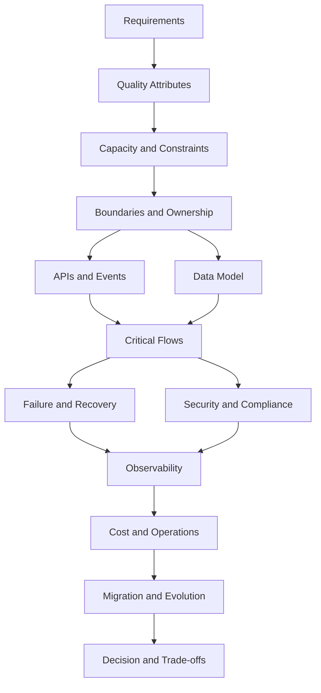

# MEKS System Design Graph

```mermaid
flowchart TB
    R[Requirements] --> Q[Quality Attributes]
    Q --> C[Capacity and Constraints]
    C --> B[Boundaries and Ownership]
    B --> API[APIs and Events]
    B --> DATA[Data Model]
    API --> FLOW[Critical Flows]
    DATA --> FLOW
    FLOW --> FAIL[Failure and Recovery]
    FLOW --> SEC[Security and Compliance]
    FAIL --> OBS[Observability]
    SEC --> OBS
    OBS --> COST[Cost and Operations]
    COST --> EV[Migration and Evolution]
    EV --> DEC[Decision and Trade-offs]
```

Every system design artifact should make these relationships explicit rather
than presenting a component diagram without operational reasoning.
